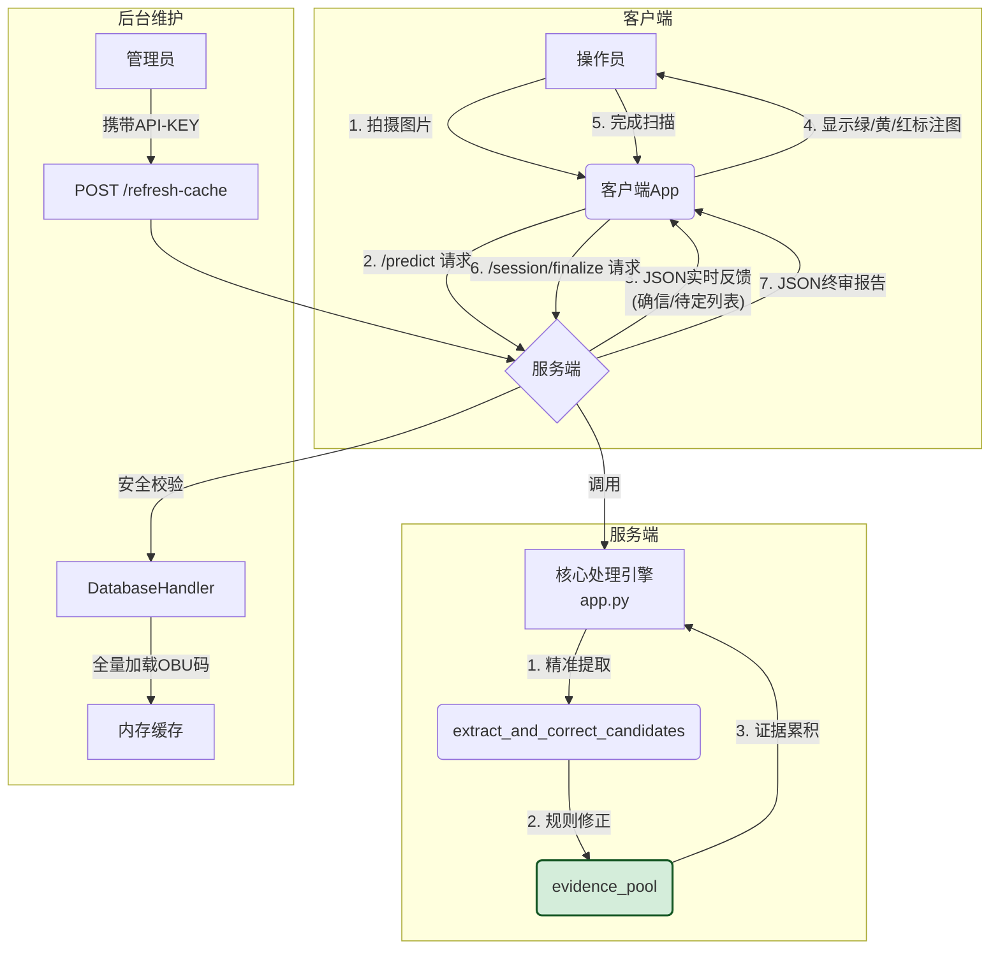

## OBU镭标码识别服务 - API及设计文档 (V8.0_Final)

**版本**: v8.0_Final_Engine

**核心理念**: **回归纯粹，精准打击。** 本版本彻底摒弃了所有有风险的“下游治理”逻辑，通过实现**精准提取**和**规则修正**的核心算法，从源头上保证识别的准确性。同时，引入了创新的**“实时高可信 + 会话终审”**架构，在提供极致准确性的同时，兼顾了生产操作的灵活性与人性化。

### 1. 项目概述与目标

- 
- **项目名称**: OBU镭标码高鲁棒性识别与证据管理系统
- **核心目标**: 提供一个能够应对各种复杂、无序场景（如新旧混装、非连续号段）的OBU镭标码识别服务。
- **V8.0版本核心功能**:
  - **精准提取引擎**: 彻底抛弃有风险的全局数字提取，采用基于“连续16位字串”原则的精准提取算法。
  - **可配置规则修正**: 集成了可配置的“头部修正”和“启发式字符替换”规则，将业务知识与算法完美结合。
  - **证据累积与晋升机制**: 对每一次识别结果进行“目击次数”累积，不再“一票否决”或“一票通过”。
  - **双阶API架构**:
    - /predict: 提供实时的、包含“确信”和“待定”分类的高质量反馈，智能引导操作。
    - /session/finalize: 在会话结束时，提供包含所有潜在识别结果的、最完整的终审报告。
  - **后台数据热更新**: 提供带安全密钥的/refresh-cache接口，可随时从数据库同步最新的OBU码列表，无需重启服务。

### 2. 系统架构简图



### 3. **最终检码规则 (V18.0)**

**核心理念**: **情景感知，动态裁决。** 本规则集不再采用单一、固定的校验逻辑，而是通过对当前已识别数据的实时“情景分析”，动态地在**“超严格模式”**、**“常规模式”**和**“混沌模式”**之间切换，以达到在不同业务场景下，鲁棒性与精准性的最佳平衡.

- - #### **阶段一：预处理与净化 (The Bouncer)**
  
    **目标**: 从原始、混乱的OCR文本中，筛选出所有**具备合法身份**的、高质量的16位纯数字候选码。此阶段为所有后续裁决提供干净、可靠的输入。
  
    - **步骤 1.1 (精准提取)**:
      - **输入**: OCR原始识别文本。
      - **动作**: 使用正则表达式 r'[A-Z0-9-]{16,20}'，提取所有由大写字母、数字、连字符组成的，长度在16到20之间的连续字串。
      - **目的**: 从源头上保证候选者的基本形态和连续性，过滤掉明显无关的噪声。
    - **步骤 1.2 (规则修正)**:
      - 对每一个提取出的候选字串，依次应用以下修正规则：
        - **a. “换头”修正**: 若config.py中启用，则对不符合预设头部的候选者，尝试进行头部替换。
        - **b. “字符”修正**: 应用启发式字典，进行高置信度的字符级纠错 (如 S->5)。
        - **c. “格式”净化**: 移除所有非数字字符 (如 -)。
    - **步骤 1.3 (格式校验)**:
      - **动作**: 筛选修正后的列表，只保留**长度正好是16位**且**完全由数字组成**的字符串。
      - **目的**: 确保所有进入下一阶段的候选者，都具备OBU码的基本数字格式。
    - **步骤 1.4 (身份初审 - 数据库查询)**:
      - **动作**: 将通过格式校验的每一个候选码，与内存中的OBU总数据库进行比对。
      - **输出**: 一个**“已验证候选码”**列表。
      - **目的**: **赋予“鬼”的资格。** 只有在总数据库中真实存在的编码，才有资格进入下一阶段的、更严苛的裁决。
  
    #### **阶段二：核心裁决 (The Context-Aware Adjudication Engine)**
  
    **目标**: 对所有已经通过“身份初审”的合法OBU码，进行基于当前批次整体“情景”的、动态的、智能的审判。
  
    - **步骤 2.1 (最高优先级裁决 - “满溢纯净”规则)**:
      - **触发**: 在审判任何一个候选码之前，对当前的“证据池”进行快照分析。
      - **条件**: 证据池总OBU数 > 50 并且 池中存在一个数量 >= 50 的连号号段？
      - **动作**:
        - **若触发**: 进入**“超严格模式”**。只接受属于该50连号的候选码，其余**立即抛弃**。
        - **若未触发**: 继续下一步。
    - **步骤 2.2 (情景分析与决策 - “混沌安全阀”)**:
      - **动作**: 对当前“证据池”进行全局的“号段识别”（基于排序和间距阈值）。
      - **条件**:
        - 条件A: 在证据池中，**找不到任何3个或以上**的连续号码。
        - **或者**
        - 条件B: 识别出的独立号段数量，超过了config.py中定义的MAX_SEGMENTS_THRESHOLD。
      - **决策**:
        - **如果满足任一条件**: 系统判定当前为**“混沌模式”**。将**完全跳过**下一步的汉明距离裁决。
        - **如果不满足任何条件**: 系统判定当前为**“常规模式”**，将继续执行下一步的汉明裁决。
    - **步骤 2.3 (核心裁决 - “多号段汉明裁决”)**:
      - **触发**: 仅在“常规模式”下执行。
      - **动作**:
        - **a. 生成多个“猜测区域”**: 基于上一步分析出的所有号段，为每一个号段都生成一个专属的“猜测区域”（基于三点定位法）。
        - **b. 多目标汉明计算与裁决**: 计算候选码与**每一个**“猜测区域”的最小汉明距离。只要它能与**任何一个**区域的距离小于等于阈值，即**通过本轮裁决**；否则，**立即抛弃**。
    - **步骤 2.4 (最终确认 - 加入证据池)**:
      - **输入**: 所有通过了前面所有关卡的幸存者。
      - **动作**: 将该候选码加入“证据池”，其“目击次数”加1。
      - **目的**: 为最终的“民主投票”和“黄绿灯”显示提供数据支持。

### 4. API接口文档

#### 4.1. 核心识别接口 (/predict)

- **用途**: 上传单张图片进行识别，并获取实时的、分类的识别结果。

- **URL**: /predict

- **Method**: POST

- **Content-Type**: multipart/form-data

- **请求参数 (Form Data)**:

  - session_id (string, **必选**): 标识当前扫描会话的唯一ID。
  - file (file, **必选**): 用户上传的OBU图片文件 (jpg, jpeg, png)。

- **成功响应 (HTTP 200)**:

  - **JSON响应体**:

    ```
    {
        "message": "File processed successfully.",
        "session_id": "xxxxxxxx-xxxx-xxxx-xxxx-xxxxxxxxxxxx",
        "session_status": "in_progress",
        "confirmed_results": [ // 确信列表 (目击次数 >= PROMOTION_THRESHOLD)
            {"text": "5001240700323409", "count": 2},
            {"text": "5001240700323410", "count": 3}
        ],
        "pending_results": [ // 待定列表 (目击次数 < PROMOTION_THRESHOLD)
            {"text": "5001240700323401", "count": 1, "box": [x1, y1, x2, y2]},
            {"text": "5001240700323402", "count": 1, "box": [x1, y1, x2, y2]}
        ],
        "current_frame_annotated_image_base64": "iVBORw0KGgo...",
        "warnings": [],
        "timing_profile_seconds": { /* ... */ }
    }
    ```

    content_copydownload

    Use code [with caution](https://support.google.com/legal/answer/13505487).Json

#### 4.2. 会话终审接口 (/session/finalize)

- **用途**: 在操作员完成所有拍摄后，调用此接口获取本次会话的最终、完整结果。

- **URL**: /session/finalize

- **Method**: POST

- **Content-Type**: application/json

- **请求体 (JSON Body)**:

  ```
  {
      "session_id": "xxxxxxxx-xxxx-xxxx-xxxx-xxxxxxxxxxxx"
  }
  ```

  content_copydownload

  Use code [with caution](https://support.google.com/legal/answer/13505487).Json

- **成功响应 (HTTP 200)**:

  - 

  - **JSON响应体**:

    ```
    {
        "message": "Session finalized successfully.",
        "session_id": "xxxxxxxx-xxxx-xxxx-xxxx-xxxxxxxxxxxx",
        "total_count": 51,
        "final_results": [ // 包含所有被目击过的OBU (无论次数)
            {"text": "5001240700323401", "count": 1},
            {"text": "5001240700323402", "count": 1},
            {"text": "5001240700323409", "count": 2}
        ]
    }
    ```

    content_copydownload

    Use code [with caution](https://support.google.com/legal/answer/13505487).Json

#### 4.3. 后台数据维护接口 (/refresh-cache)

- **用途**: **手动触发**服务端从Oracle数据库重新加载OBU码列表到内存。这在数据库中的OBU码发生增删改后非常有用，可以实现数据热更新，**无需重启服务**。

- **URL**: /refresh-cache

- **Method**: POST

- **安全校验**: 请求必须在HTTP头信息中包含正确的API密钥。

  - **Header Name**: X-API-KEY
  - **Header Value**: 您在config.py中设置的REFRESH_API_KEY值 (例如: "Vfj@1234.wq")

- **如何使用 (以curl工具为例)**:
  打开命令行工具，输入以下命令：

  ```
  curl -X POST -H "X-API-KEY: Vfj@1234.wq" http://127.0.0.1:5000/refresh-cache
  ```

  content_copydownload

  Use code [with caution](https://support.google.com/legal/answer/13505487).Bash

- **成功响应 (HTTP 200)**:

  ```
  {
      "message": "Cache refreshed successfully",
      "count": 580531 
  }
  ```

  content_copydownload

  Use code [with caution](https://support.google.com/legal/answer/13505487).Json

- **失败响应 (HTTP 403)**:

  ```
  {
      "error": "Invalid or missing API Key"
  }
  ```

  content_copydownload

  Use code [with caution](https://support.google.com/legal/answer/13505487).Json

### 5. 客户端交互建议

1. **开始扫描**: 客户端生成一个session_id。
2. **循环拍摄**:
   - 操作员拍摄图片，客户端调用/predict。
   - 客户端在界面上清晰地展示“确信列表”和“待定列表”的数量和内容。
   - 客户端解码current_frame_annotated_image_base64，显示带有**绿/黄/红**三色标注的图片，为操作员提供直观反馈。
   - 操作员根据反馈，决定是继续扫描新的OBU，还是对黄色区域进行“确认性补拍”。
3. **完成扫描**:
   - 操作员点击“完成”按钮。
   - 客户端调用/session/finalize接口。
   - 客户端展示final_results中的最终、完整列表给用户确认和保存。

### 6. 关键配置项说明 (config.py)

- OCR_ONNX_MODEL_PATH: **请务必确认**此路径指向您最终使用的v5 server ONNX模型。
- ENABLE_HEADER_CORRECTION: (True/False) 是否启用头部修正功能。
- CORRECTION_HEADER_PREFIX: (字符串) 当头部修正启用时，要替换成的正确头部，例如 "5001"。
- PROMOTION_THRESHOLD: (整数) OBU从“待定”晋升为“确信”所需的最低目击次数，建议值为 2。
- REFRESH_API_KEY: (字符串) 用于保护/refresh-cache接口的密钥，请设置为一个强密码。
