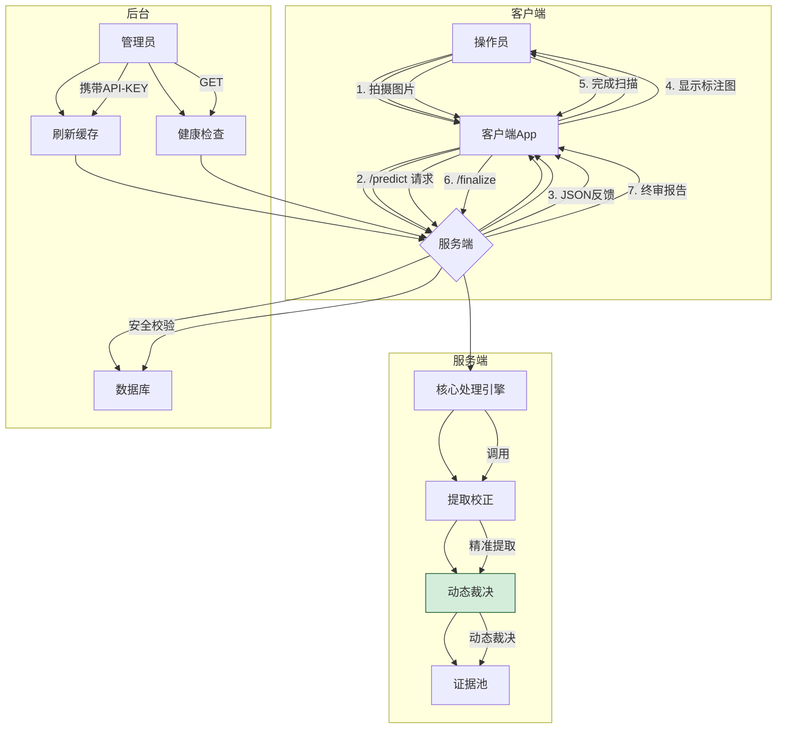

## OBU镭标码识别服务 - API及设计文档 (V8.0_Final)

**版本**: v8.0_Final_Engine

**核心理念**: **回归纯粹，精准打击。** 本版本彻底摒弃了所有有风险的“下游治理”逻辑，通过实现**精准提取**和**规则修正**的核心算法，从源头上保证识别的准确性。同时，引入了创新的**“实时高可信 + 会话终审”**架构，在提供极致准确性的同时，兼顾了生产操作的灵活性与人性化。

### 1. 项目概述与目标

- **项目名称**: OBU镭标码高鲁棒性识别与证据管理系统
- **核心目标**: 提供一个能够应对各种复杂、无序场景（如新旧混装、非连续号段、多号段混装）的OBU镭标码识别服务。
- **V19.0版本核心功能**:
  - **纯粹的零散识别模式**: 移除了所有与“整版识别”相关的冗余代码，使核心逻辑更清晰，维护成本更低。
  - **V18.1终极裁决引擎**: 固化了我们共同设计的、包含“满溢纯净”、“混沌安全阀”、“多号段汉明裁决”等规则的动态情景感知裁决引擎。
  - **证据累积与晋升机制**: 对每一次识别结果进行“目击次数”累积，并通过“黄绿灯”机制提供直观的实时反馈。
  - **双阶API架构**:
    - /predict: 提供实时的、包含“确信”和“待定”分类的高质量反馈。
    - /session/finalize: 在会话结束时，提供包含所有潜在识别结果的、最完整的终审报告。
  - **智能健康检查**: 提供/health接口，可实时监控数据库连接池和内存缓存的状态。
  - **后台数据热更新**: 提供带安全密钥的/refresh-cache接口，可随时从数据库同步最新的OBU码列表，无需重启服务。

### 2. 系统架构简图



### 3. 最终检码规则详解 (V18.1)

我们的系统严格遵循一套我们共同打磨出的、分阶段的检码规则：

#### **阶段一：预处理与净化 (The Bouncer)**

**目标**: 从原始文本中，筛选出所有**具备合法身份**的16位纯数字候选码。

1. **精准提取**: 使用 r'[A-Z0-9-]{16,20}' 提取“长得像”的连续字串。
2. **规则修正**: 依次应用“换头”、“字符替换”、“格式净化”规则。
3. **格式校验**: 只保留修正后为16位纯数字的字符串。
4. **身份初审**: 将通过格式校验的码，与内存中的OBU总数据库比对，只有存在的才能进入下一阶段。

#### **阶段二：核心裁决 (The Context-Aware Adjudication Engine)**

**目标**: 对所有已具备“合法身份”的OBU码，进行基于当前批次整体“情景”的、动态的、智能的审判。

1. **“满溢纯净”规则**: 若证据池已满50个且高度连续，则后续只接受属于该连号的码。
2. **“混沌安全阀”**: 若证据池中找不到3连号，或号段数量过多，则判定为“混沌模式”，**跳过**汉明裁决。
3. **“多号段汉明裁决”**: 在“常规模式”下，计算候选码与所有已识别号段的最小汉明距离。只有当它与**任何一个**号段足够接近时，才通过。
4. **最终确认**: 通过所有裁决的候选码，被加入“证据池”进行次数累积。

### 4. API接口文档

#### **1. 核心交互流程 (两步走)**

前端应用与后端服务的交互，主要为两步：

1. **持续识别 (/predict)**: 前端应用不断地把用户拍的照片，一张一张地发给我们这个接口。服务端会实时地回复：“哪些号码我已经看准了（确信），哪些我还想再看一眼（待定）”。
2. **获取最终结果 (/session/finalize)**: 当用户拍完所有照片，点击“完成”按钮时，前端再调用一下这个接口，服务端会把这次扫描的所有结果，一次性、完整地打包返回。

**POST 请求地址：** http://<服务器地址>:5000/predict

#### 4.1. 核心识别接口 (/predict)

- **用途**: 上传单张图片进行识别，并获取实时的、分类的识别结果。

- **URL**: /predict

- **Method**: POST

- **请求参数 (Form Data)**: session_id (string, 必选), file (file, 必选)。

- **成功响应 (HTTP 200)**:

  ```
  {
      "session_status": "in_progress", // 状态，告诉你还在进行中
      "confirmed_results": [ // “确信列表”，这些是反复看到、100%靠谱的结果
          {"text": "5001240700323409", "count": 2} 
      ],
      "pending_results": [ // “待定列表”，这些是只看到一次，需要再确认的结果
          {"text": "5001240700323401", "count": 1}
      ],
      "current_frame_annotated_image_base64": "iVBORw0KGgo..." // 这是一个Base64编码的图片字符串
  }
  ```
  
  

#### 4.2. 会话终审接口 (/session/finalize)

- **用途**: 在操作员完成所有拍摄后，调用此接口获取本次会话的最终、完整结果。

- **URL**: /session/finalize

- **Method**: POST

- **请求体 (JSON Body)**: { "session_id": "..." }

- **成功响应 (HTTP 200)**:

  ```
  {
      "total_count": 50, // 最终识别出的总数
      "final_results": [ // 最终的、完整的列表
          {"text": "5001240700323401", "count": 1},
          {"text": "5001240700323409", "count": 2}
      ]
      // ... 其他元数据 ...
  }
  ```

  

#### 4.3. 智能健康检查接口 (/health)（前端不用管这个）

- **用途**: 用于外部监控系统，检查服务的核心组件是否正常工作。

- **URL**: /health

- **Method**: GET

- **成功响应 (HTTP 200)**:

  ```
  {
      "status": "ok",
      "checks": {
          "database_pool": "ok",
          "memory_cache": "ok, 580531 items"
      }
  }
  ```

  

- **失败响应 (HTTP 503)**:

  ```
  {
      "status": "error",
      "checks": {
          "database_pool": "error: not initialized",
          "memory_cache": "ok, 580531 items"
      }
  }
  ```

  

#### 4.4. 后台数据维护接口 (/refresh-cache)（建议任务开始时调用一次）

- **用途**: 手动触发服务端从数据库热更新OBU码列表。
- **URL**: /refresh-cache
- **Method**: POST
- **安全校验**: 请求头需包含 X-API-KEY 及其正确的值。
- **调用示例**: curl -X POST -H "X-API-KEY: your_secret_key" http://127.0.0.1:5000/refresh-cache

### 5. 关键配置项说明 (config.py)

- LOG_LEVEL: 控制日志输出的详细程度，生产环境建议设为"INFO"。
- ENABLE_HEADER_CORRECTION, CORRECTION_HEADER_PREFIX: 控制“换头”规则。
- PROMOTION_THRESHOLD: “待定”晋升为“确信”的目击次数阈值。
- ENABLE_HAMMING_CHECK, HAMMING_THRESHOLD: 控制汉明裁决。
- MIN_SEGMENT_MEMBERS, SEGMENT_GAP_THRESHOLD, GUESS_RANGE: 控制“三点定位”和号段识别。
- MAX_SEGMENTS_THRESHOLD: 触发“混沌模式”的号段数量上限。
- REFRESH_API_KEY: /refresh-cache接口的密钥。

### 6. 客户端交互建议

1. **开始扫描**: 客户端生成一个session_id。
2. **循环拍摄**:
   - 操作员拍摄图片，客户端调用/predict。
   - 客户端在界面上清晰地展示“确信列表”和“待定列表”的数量和内容。
   - 客户端解码current_frame_annotated_image_base64，显示带有**绿/黄/红**三色标注的图片，为操作员提供直观反馈。
   - 操作员根据反馈，决定是继续扫描新的OBU，还是对黄色区域进行“确认性补拍”。
3. **完成扫描**:
   - 操作员点击“完成”按钮。
   - 客户端调用/session/finalize接口。
   - 客户端展示final_results中的最终、完整列表给用户确认和保存。

### 7. 关键配置项说明 (config.py)

- OCR_ONNX_MODEL_PATH: **请务必确认**此路径指向您最终使用的v5 server ONNX模型。
- ENABLE_HEADER_CORRECTION: (True/False) 是否启用头部修正功能。
- CORRECTION_HEADER_PREFIX: (字符串) 当头部修正启用时，要替换成的正确头部，例如 "5001"。
- PROMOTION_THRESHOLD: (整数) OBU从“待定”晋升为“确信”所需的最低目击次数，建议值为 2。
- REFRESH_API_KEY: (字符串) 用于保护/refresh-cache接口的密钥，请设置为一个强密码。
