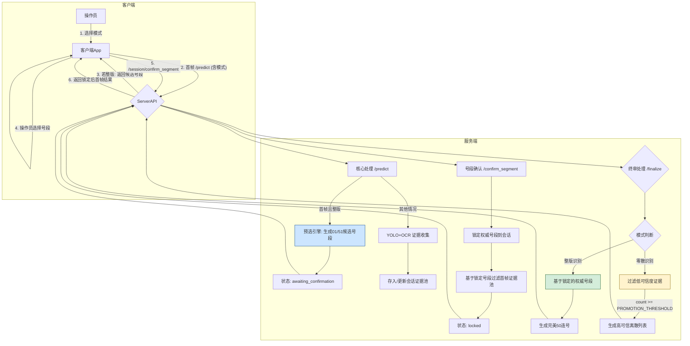
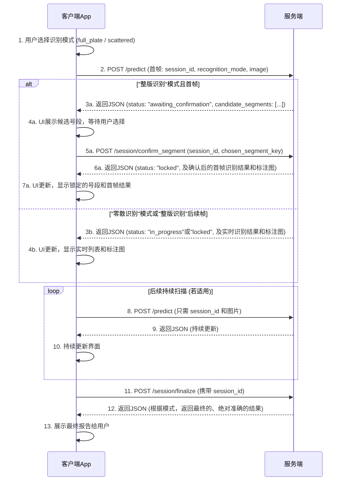

### **OBU镭标码识别服务 - API及设计文档 (V21.6 - "Libra")**

**版本**: V21.6 - "Libra"

------

**变更记录**：

- /predict新增full_plate——整版整版模式、scattered——零散识别模式
- 新增号段确认接口`/session/confirm_segment`

------

**核心理念**: **模式驱动，首帧确认，权威终审。** 本版本引入了革命性的“整版识别”与“零散识别”双模式架构。

*   在 **“整版识别”** 模式下，系统在处理第一帧图像后，会智能推荐一个或多个最可能的标准号段（如 `...01-50` 或 `...51-00`），并**强制要求操作员进行确认**。一旦操作员确认，该号段即被锁定，后续所有识别和最终结果都将严格基于此“上帝视角”的权威输入，输出完美的50位连续号段。
*   在 **“零散识别”** 模式下，系统则忠实地记录并返回经过多重验证的高可信度离散号码。
    这套架构完美兼顾了极致的准确性、操作的灵活性与业务场景的多样性。

### 1. 项目概述与目标

-   **项目名称**: OBU镭标码双模式高鲁棒性识别与证据管理系统 (Libra版)
-   **核心目标**: 提供一个能够智能适应“整版”与“零散”两种核心业务场景，并通过首帧人工确认机制确保“整版识别”准确性的OBU镭标码识别服务。
-   **V21.6版本核心功能**:
    *   **模式驱动架构**: 服务核心逻辑由 `recognition_mode` 参数驱动 (`full_plate` / `scattered`)。
    *   **首帧人工确认 (针对“整版识别”)**:
        *   第一帧处理后，系统会基于启发式规则（如 `...01` 或 `...51` 结尾）和当前证据，向客户端推荐一个或多个最可能的50位连续号段。
        *   客户端必须调用 `/session/confirm_segment` 接口，将操作员的选择反馈给服务端，用以锁定权威号段。
    *   **权威终审 (针对“整版识别”)**: 终审结果严格基于用户在首帧确认的完美50位连续号段。
    *   **高可信零散识别**: 在“零散识别”模式的终审阶段，通过置信度过滤（如：目击次数），输出高可信度的、非连续的号码列表。
    *   **智能健康检查与缓存刷新**: 保留了 `/health` 和 `/refresh-cache` 接口。

### 2. 系统架构简图


```mermaid
graph TD
subgraph 客户端
        A[操作员] -->|1. 选择模式| B[客户端App]
        B -->|"2. 首帧 /predict (含模式)"| C{ServerAPI}
        C -->|"3. 若整版: 返回候选号段"| B
        B -->|"4. 操作员选择号段"| B
        B -->|"5. /session/confirm_segment"| C
        C -->|"6. 返回锁定后首帧结果"| B
    end

    subgraph 服务端
        C --> D[核心处理 /predict]
        D -- 首帧且整版 --> D1[预选引擎: 生成01/51候选号段]
        D1 --> F_Await[状态: awaiting_confirmation]
        D -- 其他情况 --> E[YOLO+OCR 证据收集]
        E --> F_Pool[存入/更新会话证据池]
        
        C --> CS[号段确认 /confirm_segment]
        CS --> LOCK[锁定权威号段到会话]
        LOCK --> FilterPool[基于锁定号段过滤首帧证据池]
        FilterPool --> F_Locked[状态: locked]

        C --> H{终审处理 /finalize}
        H --> I{模式判断}
        I -- 整版识别 --> J[基于锁定的权威号段]
        J --> K[生成完美50连号]
        I -- 零散识别 --> L[过滤低可信度证据]
        L -- count >= PROMOTION_THRESHOLD --> M[生成高可信离散列表]
        
        F_Await --> C
        F_Locked --> C
        K --> C
        M --> C
    end

    style J fill:#d4edda,stroke:#155724
    style L fill:#fff3cd,stroke:#856404
    style D1 fill:#cce5ff,stroke:#004085
```

### 3. 核心识别逻辑详解 (V21.6 "Libra" 版)

我们的系统采用了一套多阶段、分层过滤的先进识别策略，其核心是根据操作员选择的模式，执行不同的逻辑路径。

#### **第一阶段：实时处理与证据收集 (在每次 `/predict` 调用时执行)**

1.  **候选码的提取与修正 (与V20.0一致)**:
    *   形态提取、启发式修正、格式净化、数据库校验。只有合法的16位数字才能进入下一环节。

2.  **“整版识别”模式 - 首帧处理 (核心交互点)**:
    *   当客户端以 `full_plate` 模式发送第一帧图片时，服务端会启动一个**“预选引擎”**:
        1.  收集当前帧所有合法的OBU码。
        2.  分析这些号码，找到数据最密集的区域（`dominant_segment`）。
        3.  基于这个区域的中心，智能推测出两个最可能的标准50位号段的起始码：一个以 `...01` 结尾，一个以 `...51` 结尾。
        4.  对这两个候选起始码进行一次快速“内部投票”，看它们各自能获得当前帧多少真实号码的支持。
        5.  将这两个（或一个，或零个，取决于识别情况）候选起始码，按得票数排序后，连同 `session_status: "awaiting_confirmation"` 返回给客户端。
    *   **此时，服务端会暂停对该会话的处理，等待客户端通过 `/session/confirm_segment` 接口反馈操作员的选择。**

3.  **“整版识别”模式 - 后续帧处理 / “零散识别”模式 - 所有帧处理**:
    *   **证据累积**: 所有合法的候选证据，都会被投入当前会话的“证据池” (`evidence_pool`)，并记录其“目击”次数。
    *   **实时裁决 (基于已锁定号段或通用规则)**:
        *   如果号段已被用户确认并锁定（`session_status: "locked"`），则新识别的号码会根据是否在锁定号段的容错范围内 (`GUESS_RANGE`) 进行裁决。
        *   如果号段未锁定（例如在“零散识别”模式，或“整版识别”模式的首帧自动锁定失败后降级），则会使用一套更通用的规则（如汉明距离、纯净度等）进行初步判断。
    *   **实时反馈**: 根据上述裁决结果，生成 `confirmed_results` 和 `pending_results` 返回给前端。**再次强调，这仅供参考，不代表最终结果。**

#### **第二阶段：号段确认 (通过 `/session/confirm_segment` 调用，仅用于“整版识别”模式)**

这是确保“整版识别”准确性的关键一步，完全依赖操作员的“上帝视角”。

1.  **接收用户选择**: 服务端接收客户端传来的、操作员选择的号段起始码 (`chosen_segment_key`)。
2.  **生成权威号段**: 根据这个起始码，服务端生成一个完美的、长度为50的连续号段列表（例如 `[...3401, ...3402, ..., ...3450]`）。
3.  **锁定权威号段**: 将这个完美的号段列表存储在会话的 `locked_segment_info` 中。
4.  **净化首帧证据**: 用这个权威号段，去严格过滤第一帧处理时存入 `evidence_pool` 的所有号码。只有完全属于这个权威号段的号码才会被保留。
5.  **返回确认后的首帧结果**: 基于净化后的首帧证据池，重新生成 `confirmed_results`, `pending_results` 和标注图，返回给客户端。

#### **第三阶段：终审裁决 (在调用 `/session/finalize` 时执行)**

这是最终的审判时刻，逻辑完全由会话模式驱动。

1.  **“整版识别”模式终审**:
    *   **目标**: 输出100%准确的、由用户确认的完美50位连号。
    *   **行为**:
        1.  系统从会话中获取由 `/session/confirm_segment` 接口锁定的那个完美的50位 `locked_segment_info`。
        2.  遍历这个完美列表中的每一个号码。
        3.  从整个会话过程中积累的 `evidence_pool` 中，查找这个号码的最终“目击次数”。
        4.  生成包含这50个号码及其对应目击次数的最终列表。如果某个号码在完美连号中，但从未被真实看到过（`count`为0），它依然会被包含，并标记出来。
    *   **结果**: 一个绝对纯净、绝对准确的50位连号列表。

2.  **“零散识别”模式终审 (与V20.0一致)**:
    *   **目标**: 输出经过多重确认的高可信度离散号码。
    *   **行为**: 遍历 `evidence_pool`，只保留那些“目击次数”大于等于 `config.PROMOTION_THRESHOLD` 的号码。
    *   **结果**: 一个不保证数量、不保证连续，但每个号码都相对可靠的列表。

### 4. API接口文档 (前端对接核心)

#### **交互流程图 (Sequence Diagram) - V21.6 "Libra" 版**


```mermaid
sequenceDiagram
    participant Client as 客户端App
    participant Server as 服务端
    
    Client->>Client: 1. 用户选择识别模式 (full_plate / scattered)
    Client->>Server: 2. POST /predict (首帧: session_id, recognition_mode, image)
    
    alt "整版识别"模式且首帧
        Server-->>Client: 3a. 返回JSON (status: "awaiting_confirmation", candidate_segments: [...])
        Client->>Client: 4a. UI展示候选号段，等待用户选择
        Client->>Server: 5a. POST /session/confirm_segment (session_id, chosen_segment_key)
        Server-->>Client: 6a. 返回JSON (status: "locked", 及确认后的首帧识别结果和标注图)
        Client->>Client: 7a. UI更新，显示锁定的号段和首帧结果
    else "零散识别"模式或"整版识别"后续帧
        Server-->>Client: 3b. 返回JSON (status: "in_progress"或"locked", 及实时识别结果和标注图)
        Client->>Client: 4b. UI更新，显示实时列表和标注图
    end
    
    loop 后续持续扫描 (若适用)
        Client->>Server: 8. POST /predict (只需 session_id 和图片)
        Server-->>Client: 9. 返回JSON (持续更新)
        Client->>Client: 10. 持续更新界面
    end
    
    Client->>Server: 11. POST /session/finalize (携带 session_id)
    Server-->>Client: 12. 返回JSON (根据模式，返回最终的、绝对准确的结果)
    Client->>Client: 13. 展示最终报告给用户
```

#### **4.1. 核心识别接口 (`/predict`)**(修改)

- **用途**: 上传单张图片进行识别。

  *   在“整版识别”模式的第一帧，此接口用于收集证据并返回候选号段供用户确认。
  *   在其他情况下，获取实时的、仅供参考的识别结果。

- **URL**: `/predict`

- **Method**: `POST`

- **请求参数 (Form Data)**:

  | 参数名             | 类型   | 是否必选                        | 描述                                                         |
  | :----------------- | :----- | :------------------------------ | :----------------------------------------------------------- |
  | `session_id`       | string | 是                              | 唯一标识本次扫描任务的ID。                                   |
  | `file`             | file   | 是                              | 用户拍摄的OBU图片文件。                                      |
  | `recognition_mode` | string | 仅首帧需要,后面继续传也可以接受 | 模式选择。可选值为 `'full_plate'` 或 `'scattered'`。如果未提供，服务端将使用 `config.DEFAULT_RECOGNITION_MODE`。 |

- **成功响应 (HTTP 200 或 HTTP 409)**:

  * **场景一: 需要用户确认号段时 (HTTP 200 或 409 - 建议409 Conflict)**

    ```json
    {
        "session_id": "your-session-id",
        "session_status": "awaiting_confirmation",
        "received_filename": "1.jpg", // 如果是首帧处理的响应
        "candidate_segments": ["5001240700323401", "5001240700323451"], // 推荐的号段起始码列表
        "current_frame_annotated_image_base64": null, // 【重要】此时不返回标注图
        "warnings": []
    }
    ```

  * **场景二: 正常实时反馈时 (HTTP 200)**

    ```json
    {
        "session_id": "your-session-id",
        "session_status": "locked", // 或 "in_progress" (零散模式)
        "received_filename": "2.jpg",
        "confirmed_results": [{"text": "...", "count": 2}],
        "pending_results": [{"text": "...", "count": 1}],
        "current_frame_annotated_image_base64": "iVBOR...",
        "locked_segment_info": "5001240700323401", // (整版模式锁定后)
        "timing_profile_seconds": {...},
        "warnings": []
    }
    ```

- **特别说明**:

  *   **`recognition_mode`**: 只在第一帧传，后面也传没有作用
  *   **`session_status`**: 这是关键！
      *   如果为 `"awaiting_confirmation"`: 您需要暂停连续扫描，将 `candidate_segments` 列表展示给用户选择。用户选择后，调用 `/session/confirm_segment`。
      *   如果为 `"locked"` 或 `"in_progress"`: 正常更新UI即可。
  *   `/predict` 返回的 `confirmed/pending_results` **始终仅供参考**。

- **JavaScript代码范例**: (与V20.0一致，但需注意处理 `awaiting_confirmation` 状态)

#### **4.2. 号段确认接口 (`/session/confirm_segment`) (新增)**

- **用途**: **仅用于“整版识别”模式下**，在第一帧 `/predict` 返回 `awaiting_confirmation` 后，客户端将用户选择的号段起始码发送给此接口，以锁定权威号段。

- **URL**: `/session/confirm_segment`

- **Method**: `POST`

- **请求体 (JSON Body)**:

  ```json
  {
      "session_id": "your-session-id",
      "chosen_segment_key": "5001240700323401" // 用户从 candidate_segments 中选择的那个起始码
  }
  ```

- **成功响应 (HTTP 200)**:

  ```json
  {
      "message": "Segment confirmed and locked successfully.",
      "session_id": "your-session-id",
      "session_status": "locked", // 状态变为已锁定
      "received_filename": "1.jpg", // 确认的是哪一帧
      "confirmed_results": [{"text": "...", "count": 1}, ...], // 基于确认号段过滤后的首帧结果
      "pending_results": [],
      "current_frame_annotated_image_base64": "iVBOR...", // 【重要】此时返回首帧的标注图
      "locked_segment_info": "5001240700323401",
      "timing_profile_seconds": {},
      "warnings": []
  }
  ```

- **特别说明**:

  *   当且仅当 `/predict` 返回 `awaiting_confirmation` 时，才调用此接口。
  *   此接口成功返回后，会包含第一帧基于已确认号段的识别结果和标注图，您可以直接用它更新UI。之后就可以继续调用 `/predict` 处理后续图片了。

- **JavaScript代码范例**:

  ```javascript
  async function confirmSegment(sessionId, chosenKey) {
    try {
      const response = await fetch('http://<服务器地址>:5000/session/confirm_segment', {
        method: 'POST',
        headers: { 'Content-Type': 'application/json' },
        body: JSON.stringify({ session_id: sessionId, chosen_segment_key: chosenKey }),
      });
      if (!response.ok) throw new Error(`HTTP error! status: ${response.status}`);
      const result = await response.json();
      console.log('号段确认结果:', result);
      // 用 result 更新UI，特别是标注图和识别列表
      return result; 
    } catch (error) {
      console.error('号段确认失败:', error);
      return null;
    }
  }
  ```

#### 4.3. 会话终审接口 (/session/finalize)

- **用途**: 在操作员完成所有拍摄后，调用此接口获取本次会话的最终、完整结果。

- **URL**: /session/finalize

- **Method**: POST

- **请求体 (JSON Body)**: { "session_id": "..." }

- **成功响应 (HTTP 200)**:

  - **场景一: “整版识别”模式下的响应**

    ```
    {
        "message": "Session finalized successfully.",
        "session_id": "your-session-id",
        "total_count": 50,
        "final_results": [ // 这是一个完美的、长度为50的连续号段列表
            {"text": "5001240700323401", "count": 3},
            {"text": "5001240700323402", "count": 4},
            // ... 中间省略 ...
            {"text": "5001240700323450", "count": 2}
        ]
    }
    ```

  - **场景二: “零散识别”模式下的响应**

    Generated json

    ```
    {
        "message": "Session finalized successfully.",
        "session_id": "your-session-id",
        "total_count": 3, // 数量不固定
        "final_results": [ // 这是一个离散的、高可信的号码列表
            {"text": "5001240700111111", "count": 2},
            {"text": "5001240700222222", "count": 3},
            {"text": "5001240700333333", "count": 2}
        ]
    }
    ```

    

- **特别说明**:

  - 这是获取**最终要保存和展示的结果**的唯一接口。
  - 需要根据会话开始时用户选择的模式，来预期 final_results 的数据结构。不过，无论哪种模式，final_results 都是一个对象数组，每个对象都包含 text 和 count，所以您的渲染逻辑可以保持一致。

- **可以直接使用的JavaScript代码范例 (fetch API)**:

  ```
  async function finalizeSession(sessionId) {
    try {
      const response = await fetch('http://<服务器地址>:5000/session/finalize', {
        method: 'POST',
        headers: {
          'Content-Type': 'application/json',
        },
        body: JSON.stringify({ session_id: sessionId }),
      });
  
      if (!response.ok) {
        throw new Error(`HTTP error! status: ${response.status}`);
      }
  
      const finalReport = await response.json();
      console.log('最终报告:', finalReport);
      
      // 在这里将 finalReport.final_results 列表作为最终结果展示给用户
      // 并可以提供保存或导出的功能
      
    } catch (error) {
      console.error('获取最终报告失败:', error);
    }
  }
  ```

**响应体字段说明**:

| 字段名                | 类型          | 描述                                                         |
| --------------------- | ------------- | ------------------------------------------------------------ |
| message               | string        | 操作成功的提示信息。                                         |
| session_id            | string        | 已终审并清理的会话ID。                                       |
| total_count           | integer       | 本次会话最终识别出的去重后的OBU码总数。                      |
| final_results         | array[object] | **最终结果清单**。此列表包含了会话中所有被识别出的OBU码，是最终需要呈现给用户并归档的数据。 |
| final_results[].text  | string        | 16位OBU码。                                                  |
| final_results[].count | integer       | 该OBU码在整个会话中被成功识别的总次数。                      |

#### 4.4. 智能健康检查接口 (/health)（前端不用管这个）

- **用途**: 用于外部监控系统，检查服务的核心组件是否正常工作。

- **URL**: /health

- **Method**: GET

- **成功响应 (HTTP 200)**:

  ```
  {
      "status": "ok",
      "checks": {
          "database_pool": "ok",
          "memory_cache": "ok, 580531 items"
      }
  }
  ```

  

- **失败响应 (HTTP 503)**:

  ```
  {
      "status": "error",
      "checks": {
          "database_pool": "error: not initialized",
          "memory_cache": "ok, 580531 items"
      }
  }
  ```

  

#### 4.5. 后台数据维护接口 (/refresh-cache)（建议任务开始时调用一次）

- **用途**: 手动触发服务端从数据库热更新OBU码列表。
- **URL**: /refresh-cache
- **Method**: POST
- **安全校验**: 请求头需包含 X-API-KEY 及其正确的值。
- **调用示例**: curl -X POST -H "X-API-KEY: your_secret_key" http://127.0.0.1:5000/refresh-cache

### 5. 关键配置项说明 (`config.py`) - V21.6 "Libra" 版

*   **`RECOGNITION_MODE_FULL_PLATE`**: (字符串常量) `'full_plate'`
*   **`RECOGNITION_MODE_SCATTERED`**: (字符串常量) `'scattered'`
*   **`DEFAULT_RECOGNITION_MODE`**: (字符串) 默认识别模式，建议设为 `RECOGNITION_MODE_SCATTERED` 或 `RECOGNITION_MODE_FULL_PLATE`。
*   **`EXPECTED_OBU_COUNT`**: (整数) 在“整版识别”模式下，期望的OBU数量，固定为 `50`。
*   **`SEGMENT_AMBIGUITY_THRESHOLD`**: (整数) 在首帧预选引擎中，如果两个候选号段的票数之差小于等于此值，则都推荐给用户。
*   **`PROMOTION_THRESHOLD`**: (整数) 在“零散识别”模式终审时，或实时反馈中，号码被视为“确信”所需的最低目击次数。
*   (其他如 `GUESS_RANGE`, `OCR_HEURISTIC_REPLACEMENTS` 等保持不变)

### 6. 客户端交互建议 - V21.6 "Libra" 版

1.  **开始扫描**: UI提供模式选择 (`full_plate` / `scattered`)。客户端记录选择。
2.  **第一帧**: 调用 `/predict`，传递 `session_id`, `file`, 和 `recognition_mode`。
    *   **如果返回 `awaiting_confirmation`**:
        *   UI弹出选择框，展示 `candidate_segments`。
        *   用户选择后，客户端调用 `/session/confirm_segment`，传递 `session_id` 和 `chosen_segment_key`。
        *   用 `/confirm_segment` 的响应更新UI（首帧结果和标注图）。
    *   **如果返回其他状态 (如 `in_progress`)**: 直接用响应更新UI。
3.  **循环拍摄后续帧**: 调用 `/predict` (只需 `session_id` 和 `file`)。用响应更新UI。
4.  **完成扫描**: 调用 `/session/finalize`。用响应的 `final_results` 展示最终报告。

---

