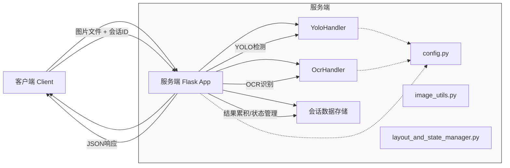

## OBU镭标码识别服务 - API及设计文档(V3.4_P1_ScatterFocus)

**版本**: v3.4_P1_ScatterFocus

 (由于新发现有多种OBU泡沫板导致需求变化引发实现步骤变化。主要实现“累积式零散识别”模式，冻结高级“整版识别”模式作为下一版迭代内容)

### 1. 项目概述与目标

*   **项目名称**: OBU镭标码智能识别与矩阵管理系统 (当前阶段聚焦于服务端识别核心)
*   **核心目标**: 提供一个能够接收OBU设备图片，并通过YOLO目标检测和OCR文字识别，提取图片中所有OBU镭标码的服务。
*   **当前版本主要功能**:
    *   支持**“累积式零散识别”模式**：用户可以连续上传多张图片（属于同一个扫描会话），服务端会累积所有已识别的OBU码，并在每次请求后返回完整的累积列表以及当前帧的可视化标注图。
    *   (保留“整版布局识别”模式的代码框架，但当前版本默认不启用，作为后续迭代内容。)

### 2. 系统架构简图


*   **说明**:
    *   客户端通过HTTP POST请求将图片和会话ID发送到服务端。
    *   服务端`app.py`作为主控制器，协调`YoloHandler`进行目标检测，`OcrHandler`进行文字识别。
    *   识别结果在会话数据存储中进行累积（当前为内存字典）。
    *   服务端返回包含累积结果和当前帧标注图的JSON响应。
    *   `config.py`提供所有配置参数。
    *   `image_utils.py`提供图像处理工具。
    *   `layout_and_state_manager.py`中与“整版识别”相关的复杂逻辑在当前版本被“冻结”，不参与“累积式零散识别”模式的核心流程。

### 3. 核心功能模块说明

*   **`app.py`**:
    *   Flask应用入口，定义API接口 (`/predict`)。
    *   负责接收客户端请求，管理会话（创建、获取、更新）。
    *   编排核心处理流程 `process_image_with_ocr_logic`。
    *   根据处理模式（当前固定为“累积式零散识别”）调用相应模块。
    *   构造并返回JSON响应。
*   **`yolo_handler.py` (`YoloHandler` 类)**:
    *   封装YOLOv8模型的加载、图像预处理、推理和后处理。
    *   输出：检测到的OBU边界框列表及其置信度。
*   **`ocr_handler.py` (`OcrHandler` 类)**:
    *   封装OCR模型的加载和并行/串行识别。
    *   负责从YOLO检测框中裁剪ROI、进行OCR预处理、调用OCR引擎识别文本、整合结果。
    *   （新增）支持按需保存用于训练的预处理后ROI图像。
*   **`image_utils.py`**:
    *   提供通用的图像处理函数，如图像读取、裁剪、绘制标注等。
*   **`config.py`**:
    *   集中管理所有可配置参数，如模型路径、阈值、保存开关等。
*   **`session_data_store` (内存字典)**:
    *   用于存储会话状态。在“累积式零散识别”模式下，主要存储每个会话已累积识别的OBU文本列表（或更详细的信息）和帧计数器。

### 4. “累积式零散识别”模式详解

*   **目的**: 快速识别用户上传图片中的所有OBU码，并持续累积一个会话中所有已识别的OBU码，同时为当前处理的帧提供即时的视觉反馈。
*   **工作流程**:
    1.  客户端发起一个新会话（或使用已有会话ID），上传一张图片。
    2.  服务端接收图片，进行YOLO检测，得到OBU候选框。
    3.  对每个候选框进行OCR识别，得到OBU文本和置信度。
    4.  对识别出的OBU文本进行校验（例如，是否在 `VALID_OBU_CODES` 中）。
    5.  将当前帧所有通过校验的OBU文本（去重后）添加到该会话的“累积OBU列表”中。
    6.  在当前帧的原始图像上，绘制YOLO检测框和成功识别的OBU文本，生成一张标注图。
    7.  将这张标注图缩小到预设尺寸（例如，宽度600像素），进行JPEG编码，然后Base64编码。
    8.  返回JSON响应，包含：
        *   完整的“累积OBU列表”（例如，只包含文本字符串的列表）。
        *   当前帧缩小标注图的Base64编码字符串。
        *   其他状态信息（如会话ID、处理状态等）。
*   **用户交互**: 用户可以连续上传图片。每次上传后，客户端都会显示更新后的完整累积列表和当前这张图片的标注情况。用户可以根据这些反馈决定何时结束扫描。

### 5. API接口文档 (`/predict`)

*   **URL**: `/predict`
*   **Method**: `POST`
*   **Content-Type**: `multipart/form-data`
*   **请求参数 (Form Data)**:
    *   `session_id` (string, **必选**): 标识当前扫描会话的唯一ID。客户端在开始一个新的扫描批次时应生成一个新的UUID，并在后续属于该批次的请求中始终使用此ID。
    *   `file` (file, **必选**): 用户上传的OBU图片文件 (支持jpg, jpeg, png)。
    *   `mode` (string, 可选, **当前版本服务端会忽略此参数并固定行为**):
        *   理论上可选值为:
            *   `'scattered_cumulative_ocr'` (默认，且为当前版本唯一支持的核心功能): 执行累积式零散识别。
            *   `'full_layout'` (暂时冻结): 执行整版布局识别。
        *   **建议客户端当前版本固定发送 `'scattered_cumulative_ocr'` 或不发送此参数。**
    *   `force_recalibrate` (string, 可选, **当前版本服务端会忽略此参数**):
        *   理论上可选值为: `'true'` 或 `'false'`。
        *   原用于“整版识别”模式下强制重新校准布局，在当前聚焦的模式下无实际作用。

*   **成功响应 (HTTP Status Code: 200)**:
    *   **Content-Type**: `application/json`
    *   **JSON响应体结构 (针对 `mode_processed: 'scattered_cumulative_ocr'`)**:
        ```json
        {
            "message": "File processed successfully.",
            "session_id": "xxxxxxxx-xxxx-xxxx-xxxx-xxxxxxxxxxxx",
            "received_filename": "1-1.jpg",
            "mode_processed": "scattered_cumulative_ocr",
            "timing_profile_seconds": {
                "1_image_reading": 0.123,
                "2_yolo_detection": 0.045,
                "3_ocr_processing": 1.234,
                "4_scattered_processing": 0.056 // 包含累积和图像编码的时间
            },
            "warnings": [ // 可能为空列表
                // {"message": "警告信息", "code": "WARNING_CODE"}
            ],
            "accumulated_results": [ // 所有已累积识别的OBU信息列表
                {"text": "5001240700323440"},
                {"text": "5001240700323441"},
                // ... 更多OBU文本 ...
                // 未来可以扩展为包含更详细信息的字典，如首次出现的bbox等
            ],
            "current_frame_annotated_image_base64": "iVBORw0KGgoAAAANSUhEUgAAAZAAAADSCAMAAABF... (很长的Base64字符串)",
            "session_status": "scattered_recognition_in_progress" // 或 "scattered_recognition_completed" (如果实现了expected_count)
        }
        ```
    *   **JSON响应体结构 (如果未来启用了 `mode_processed: 'full_layout'`)**:
        ```json
        {
            "message": "File processed successfully.",
            "session_id": "xxxxxxxx-xxxx-xxxx-xxxx-xxxxxxxxxxxx",
            "received_filename": "1-1.jpg",
            "mode_processed": "full_layout",
            "timing_profile_seconds": { /* ... */ },
            "warnings": [ /* ... */ ],
            "obu_status_matrix": [ // 13x4 的二维数组
                [0, 0, 1, 2], 
                /* ... 其他行 ... */
                [-1, 1, 1, -1] 
            ],
            "obu_texts": { // (r,c) -> OBU文本 的映射
                "0_2": "5001240700323401",
                "12_1": "5001240700323450"
            },
            "session_status": "in_progress" // 或 "completed", "first_frame_anchor_error"
        }
        ```

*   **失败响应 (HTTP Status Code: 4xx, 5xx)**:
    *   **Content-Type**: `application/json`
    *   **JSON响应体结构 (示例)**:
        ```json
        {
            "error": "错误描述信息",
            "session_id": "xxxxxxxx-xxxx-xxxx-xxxx-xxxxxxxxxxxx" // 如果能获取到
        }
        ```
        或者，如果是我们“行政干预”返回的，`warnings` 字段会包含具体的错误信息和code。

### 6. 客户端交互建议 (针对“累积式零散识别”模式)

1.  **会话开始**:
    *   客户端生成一个唯一的 `session_id` (例如UUID)。
    *   （当前版本不需要用户选择模式，默认即为新模式）。
2.  **图片上传与处理**:
    *   用户选择或拍摄一张图片。
    *   客户端将图片文件和 `session_id` 通过POST请求发送到 `/predict` 接口。
3.  **结果展示**:
    *   客户端接收JSON响应。
    *   **显示累积OBU列表**: 从 `response_json.accumulated_results` 中获取OBU文本列表，并清晰地展示给用户（例如，在一个可滚动的列表中，可以显示累积总数）。
    *   **显示当前帧标注图**: 从 `response_json.current_frame_annotated_image_base64` 中获取Base64编码的图像数据，解码并在界面上显示这张缩小的标注图。用户可以通过这张图快速了解当前这张照片的识别情况。
    *   **处理警告信息**: 如果 `response_json.warnings` 不为空，应向用户展示这些警告。
4.  **继续或结束**:
    *   用户可以根据显示的累积结果和当前帧标注图，决定是继续拍摄下一张图片（复用同一个 `session_id`），还是结束本次扫描。
    *   （未来如果服务端支持 `expected_count`，客户端可以在达到数量后提示用户已完成）。

### 7. 诊断与调试图说明

在服务端 `config.py` 中开启 `SAVE_PROCESS_PHOTOS = True` 时，会在服务器的 `process_photo` 目录下生成以下调试图片，以会话ID和帧号等信息命名：

*   **`process_photo/yolo_raw/yolo_raw_*.jpg`**: 纯YOLO检测结果图。显示原始图片上YOLO模型检测到的所有边界框，不含OCR文本。用于判断YOLO检测本身的准确性。
*   **`process_photo/training_rois/SESSION_ID/f*_yolo*_h*_w*.png`**: （需开启 `config.SAVE_TRAINING_ROI_IMAGES = True`）保存经过我们自己所有预处理后、直接送入OCR引擎的ROI图像切片。这些是准备训练物料的基础。
*   **（冻结功能）`process_photo/frame_layout_projection_*.png`**: 单帧逻辑投射图。在“整版识别”模式下，可视化 `_analyze_layout_by_xy_clustering` 的聚类结果和全局逻辑坐标。
*   **（冻结功能）`process_photo/annotated_*.jpg`**: 最终YOLO标注图。在“整版识别”模式下，显示原始图片、YOLO框以及最终被填充到逻辑矩阵中的OBU文本。

### 8. 后续迭代方向 (简述)

*   优化OCR预处理，提升识别准确率。
*   对OCR识别模型进行微调。
*   为“累积式零散识别”模式增加 `expected_count` 功能。
*   重新评估并优化“整版布局识别”模式的算法鲁棒性，特别是：
    *   `_analyze_layout_by_xy_clustering` 的XY轴聚类阈值的自适应算法。
    *   第一帧在无特殊行情况下的锚定回退机制。
    *   “空位推断”逻辑。
*   考虑更持久化的会话存储方案（例如Redis或数据库）。

